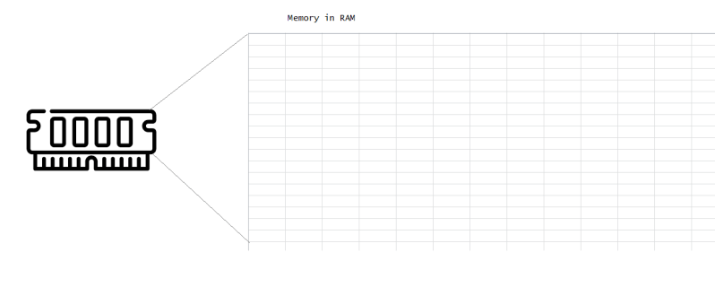

### Compiler and Interpreter

### CaseStudy-1
* Lets take an example of Avengers Movie. 
* This movie is made in english and realeased worldwide. 
* To make the reach wider, the movie was dubbed in local languages


* How does this dubbing work?
  * Conversations are converted into local languages before the movie is played in theatres
  * Play time will be same in all languages

    

### Compiler (CaseStudy-1)
* Compiler converts source code into machine language (or intermediate language) before the program is executed. This is what we call as compilation.
* Example C-Program on windows
  * Compile C-program into windows exe using a compiler which can compile to windows
  * Compile C-program into Mac using a compiler which can compile to mac

### CaseStudy-2
* Obama speech in India to local crowd Preview
* How does this work?
  * To make the speech reach to audience we have a translator
  * Translator converts during the speach
  * This might take more time as the conversion is happening live
  
### Interpretor (CaseStudy-2)
* Interpretor has to be present where the application is running
* Interpretor converts the source language into machine language while the application is running.
* To make Java Programs run on window
  * We install JDK on Windows and then run java code
* To make Python Code run on Mac
  * We install python on mac and then execute python code

### Memory allocations and Memory Leaks
* When any application is executed, it needs memory and memory is provided to programs using RAM.
* The memory in RAM looks like:



* Each location in this memory will have address and assume each block is of size 1 byte
* When applications they request memory and the size has to be specified, to simplify this in programming languages we have __DataTypes__
* __Datatype__ primarily will tell size required.
```
# c or C# or Java
int a

Please allocate memory for int which is 4 bytes and call it as a

float b

please allocate memory for float which is 8 bytes and call it as b
```
* In Some Datatype it is easy to tell the size upfront like int below
```
int = 4 bytes = 32 bits => -2^16 to 2^16-1
                           -65,536 to 65,535

int index = 10   => size 4 bytes

index = 1000     => size 4 bytes
```
* Lets assume text/strings, each character takes 2 bytes
```
string message = "hello" => size = 10 bytes

message = "how are you" => size = 22 bytes
```
* In some datatypes memory might increase with value changes

* To cope up with this problem, programming languages use

  * Mutable dataypes: Change in value will not impact memory allocations
  * Immutable datatypes: If the variable value is changed a new memory location is created
```
mutable
a = 10   address (a) => 0x1234
a = 15   address (a) => 0x1234
```
```
Immutable
a = 10   address (a) => 0x1234
a = 15   address (a) => 0x2345
```
* Memory Leak: Memory leak is the memory which has been given to your application, which is not in use by your program and also is not relased/free/deallocated.

* Garbage Collector: In some older programming languages, when you allocate memory it is your responsibility to free it. These days all the major programming languages come with Garbage Collector. Garbage collector responsiblity is to free the unused memory