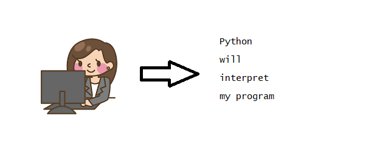
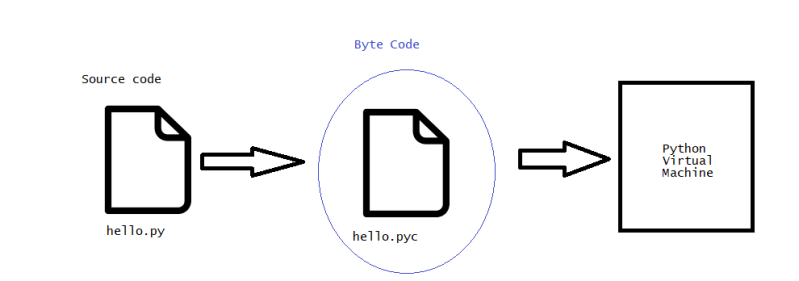

### Python Interpreter
* Python Interpreter executes the python programs.
* When you install python on your system, interpreter is also part of installation.
* Python interpreter will read your program & execute.
* Lets create a simple program called as hello.py
```python
print("hello python")
```
* Open terminal on your system (Powershell)


* To understand how this program executed lets look at two view

### Programmer’s view
* Our program consists of print statement, Now interpreter will find where the print is defined and execute it.
* When we run our programs it appears as if python is interpreting.



### Pythons view
* Program is read and then compiled to bytecode, this bytecode is executed by python interpretor.


### Bytecode compilation
* bytecode of your programs end with .pyc extension.
* When will it will
  * Source code changes
  * Change in the modules
* Python bytecode is executed by Python Virtual Machine (PVM)


### Python Implementations
* Python is a open source and Python has various implementations
* Lets look at 4 popular implemenation which are production ready
  * CPython
  * Jython
  * IronPython
  * PyPy
* These implemenatios deal with how to generate byte code & how to run PVM. As a developer your code for python will not change per implemenations

### CPython
* Referred as Classic Python & it most up-to-date & widely used flavor of python.
* CPython is a compiler, interpreter & set of built-in and options extensions & all of this is implemented in Language C
  
### Jython
* Jython is Python implementation for any Java Virtual Machine
* Python code gets converted into Java Byte code & then is executed using JDK

### IronPython
* IronPython is Python implementation for any .net framework
* Python code gets converted into MSIL (Microsoft Intermediate Language) & gets executed using .net framework

### PyPy
* The subset of Python is coded in Python iteself.

### Other Implementations
* PYJION: Opensource project from Microsoft whose primary goad is to add API to CPython
* Anaconda & miniconda: This is Python distribution from Continuum Analytics. Along with Python standard library Anaconda adds some interesting libraries. They have a packaging technolongy called conda.
* NUTIKA: Converts your python code into C++
* GRUMPY: Converts Python Code in to Go.

### Note
* In this course we will be using Standard Python(CPython).

### Python Development & Versions
Python’s intellectual property is vested in [Python Software Foundation](https://www.python.org/psf/).
All the proposed changes in Python are detailed as [Python Enhancement Proposals (PEPS)](https://www.python.org/dev/peps/).
There are some information PEP’s for developers who use python.
  * [Zen of python](https://www.python.org/dev/peps/pep-0020/)

    

  * [Style Guide](https://www.python.org/dev/peps/pep-0008/)

### Installing Python
* Windows: Download installer [from here](https://www.python.org/downloads/) & install.
* Mac: Install homebrew & use homebrew to install python
* Linux:
```
Download tar file
untar the file 
add the folder to the path
```