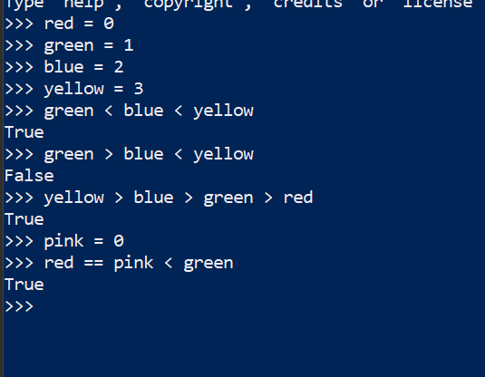

### Numeric intelligence of python (Contd..)


### Comparisions
* For comparisions python3 has following operators ```< > <= >= == !=```
* Our python3 does know two kinds of comparisions.
  1. Normal


  2. Chained




### Integer Precisions
* Python 3 supports integers of unlimited size


### Decimals
* What is value of 0.1+0.1+0.1-0.3? For us, its zero. But how about python3?


* I can solve this and show the result as zero if you use fixed point numbers using Decimal


### Some other built-in Numeric Tools (Super powers)
* math


* random


### Lets use our python3 to build a number guessing game
* We will tell python3 to remember some number randomly.
* Now we will ask user to enter inputs.
  * if the value entered by user is less than number remeber give hints to the user.
```
Do you want a play a number guessing game?
Let me memorize a value between 1 to 100. Done
Start guessing
10
You are close, guess little bit higher
90
You are too much far away, guess smaller number
30
Great, you are wonderful at guess, play poker/rummy today
I 
```

### Fun with python3
* We are observing strange behavior from python3


* Is the behavior strange or our understanding of python3 w.r.t lists should be changed, Lets discuss this in our next session