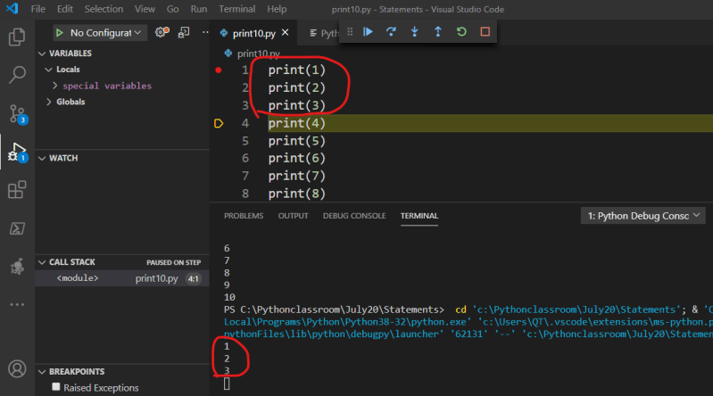

### Number Guessing Logic
* Number guessing question:
```
Lets use our python3 to build a number guessing game
We will tell python3 to remember some number randomly
Now we will ask user to enter inputs
if the value entered by user is less than number remeber give hints to the user
```
* Lets use our old friend Jarvis & Speak english


* Lets write plain english to communicate with jarvis
```
Hi Jarvis,
Generate a random number between 1 and 100 & remember it as target
continue till user wins or accepts defeat
Now ask user for entering his guess
if the number matches display success message
if the number doesnt match 
   find if the user has guessed the number higher than target 
       if yes ask him to guess a lower number
       else ask him to guess higher
       ask him to accept defeat and quit
```
* If we want to speak with python3 we need to understand statements

### Python Statements
* In simple terms __statements__ are the things you write to tell python what your program has do.
* Python Coneptual Hierarchy
  1. Programs are composed of modules
  2. Modules are composed of statements
  3. Statements are composed of expressions
  4. Expressions create & process objects

* Minimal Python Statement Set


* Till we discuss about modules in depth, each python file (filename.py) is a module
* Lets create a python file which prints 10 numbers with following
```
print(1)
print(2)
print(3)
print(4)
print(5)
print(6)
print(7)
print(8)
print(9)
print(10)
```
* In the above module each line with print represents a statement.
* Now lets run the program


* Any line which starts with # will not be executed by python
```
print(1)
print(2)
print(3)
print(4)
print(5)
print(6)
print(7)
print(8) #print 8
#print(9)
print(10)
```


* Now can we write a python program to print 1 million numbers
* Setup this program in Visual Studio Code [For installing Visual Studio Refer Here](https://www.youtube.com/watch?v=mRILfUNbsIo)
* Install python extension


* Understanding Intellisense:


* Execute the Program from vscode


* See the output of the program in the Terminal


### Getting into Debugging
* Python executes the statement one after other and shows the output.
* Shall we understand program execution? for that we need to debug
* We need to tell editor (IDE) from where do you want to take control of execution and in that line enable **breakpoint**
* Put the cursor the line where you want to take control from and Toggle Breakpoint


* Now start debugging
  


* Now the program execution stops on line 1 and from there step over (Execute this line and stop and next line)


