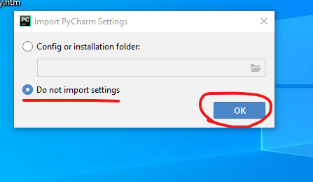

### PyCharm
* This is most popular IDE for python language.
* This has best of the class features such as:
  * Code completion and inspection
  * Advanced debugging
  * Supports for web programming & Frameworks such as Django, Flask and many more.
* Pycharm has the following flavors
  * Community
  * Professional (Paid)
* Initially we will be using the Community Edition of PyCharm.
[Refer Here](https://www.jetbrains.com/pycharm/download/#section=windows) for download links
* PyCharm can be installed on Windows, MAC & Linux

* Download PyCharm Community Edition & install as per installation instructions

* Lets start PyCharm and setup one time settings

* This is Starting Screen of PyCharm

* Lets create a new project using PyCharm

* Create a New python file for implementing a class called as Number and create a simple is_even method
* PyCharm starts hinting you

* Now add docstring to the Number class

* KeyMaps

* Finding Shortcuts:

* PyCharm Navigation

