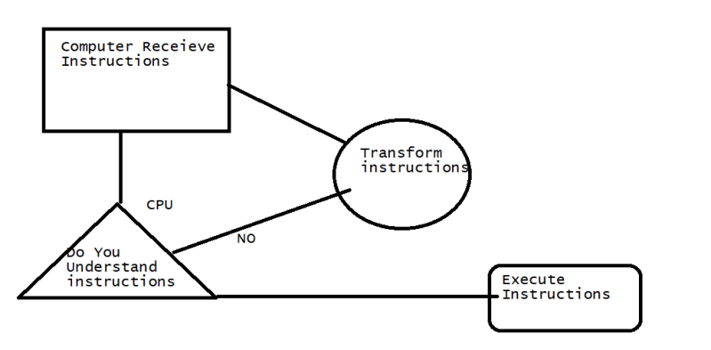

### Why Programming?
* In majority of cases we do programming to get paid.
* Organizations might need
  * Some applications
  * Automate some of the manual work
* Building apps/games etc..

### What happens when you run applications

### How do I build applications
* Speak/write to Processor directly
  * Processor understands 0’s or 1’s
* Speak/Write the language that is easy for humans to understand
  * Assembly languages
  * High Level Languages
* With High Level Languages, we need some one to transform instructions
  * Compiler
  * Interpreter
* These High Level Languages are also referred as Programming Languages, Some of Popular Programming languages are:
  * Bash: It is automating command line tasks on linux/unix
  * C: As a general purpose language
  * C++
  * Java
  * C#
  * Python
  * Ruby
  * Objective-c
  * Swift
  * JavaScript

### Getting to Know Your Computer
* Computer is stupid.
  * Computer follows instructions, if your instructions are good enough, you can even play chess
* Computers seem to be intelligent depending on instructions which we pass (applications).

### How Programs work
* Programs work as shown below:

* To store results in ram we generally use some thing as variables
* To tell how much of memory should i reserve on RAM we use datatypes.

### How to be effective in Writing Programs
1. Don’t directly write programs
2. Lets introduce a character ‘Snake’ or ‘Kid’, to which we will communicate our intentions
   * ‘Snake’ or ‘Kid’ knows how to reserve memory in RAM
   * ‘Snake’ or ‘Kid’ knows how to add, subtract, divide, multiplicate
3. We would try to speak with ‘Snake’ or ‘Kid’ to get our logics implemented
